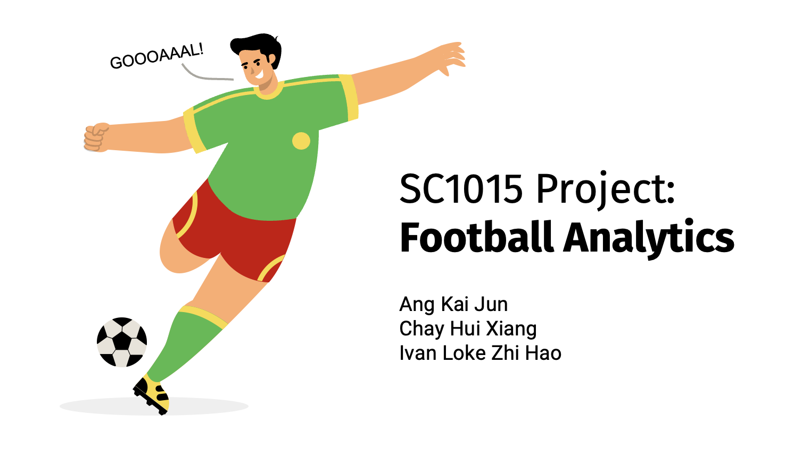

# SC1015 Data Science and Analytics Project - OPTIMU Analytics ⚽


# Table of Contents 🛎️
- [SC1015 Data Science and Analytics Project - OPTIMU Analytics ⚽](#sc1015-data-science-and-analytics-project---optimu-analytics-)
- [Table of Contents 🛎️](#table-of-contents-️)
- [Repository Structure 🧬](#repository-structure-)
- [Current Problems 🤔](#current-problems-)
    - [**1. Poor Business Management**](#1-poor-business-management)
    - [**2. Managerial Instability**](#2-managerial-instability)
    - [**3. Poor transfer policy**](#3-poor-transfer-policy)
- [Problem Statement 🚨](#problem-statement-)
- [Approach ⚙️](#approach-️)
- [Introduction to Codebase 🖥️](#introduction-to-codebase-️)
    - [Anomaly\_Detection](#anomaly_detection)
    - [Player\_Valuation](#player_valuation)
    - [Video Presentation](#video-presentation)
    - [Slides](#slides)
    - [Assets](#assets)
- [Contributors 👨‍💻](#contributors-)

# Repository Structure 🧬
```
|
├── README.md
├── Anomaly_Detection
│   ├── data
│   │    ├── fbref_data                 # Data from Fbref
│   │    └── sofifa_data                # Data from Sofifa
│   └── anomaly_detection.ipynb         # Notebook for anomaly detection
│
├── Player_Valuation
│   ├── Data                            # Data from Fbref and collated data from kaggle
│   └── player_valuation.ipynb          # Notebook for player valuation
│
├── Video Presentation
└── Slides
└── Assets
```

# Current Problems 🤔
### **1. Poor Business Management**

Manchester United’s owners, the Glazers, have been accused of negligence and poor debt management.

### **2. Managerial Instability**
After the retirement of Sir Alex Ferguson in 2013, the club has gone through several managers who have struggled to replicate his success.

### **3. Poor transfer policy**
Over the past few years, Manchester United has been criticised for leaving deadwood in the team and paying excessively high transfer fees for players.

# Problem Statement 🚨

<blockquote align='center'> 
<h3>How can Manchester United better optimise its transfer strategy to improve the team's performance?</h3>
</blockquote>

# Approach ⚙️
We will be using a **2-pronged Data Science Oriented approach** to improve Manchester United's team performance.

1. Doing *anomaly detection* on their entire squad over the past season to determine underperforming players to sell


2. Doing *player valuation estimations* on potential transfer targets to avoid overpaying in the transfer market

The additonal revenue earned can then be used to improve club facilities or improve the quality of coaching/services provided to the players with the assumption that better facilites and coaching can improve a team's performance.

# Introduction to Codebase 🖥️

<div align='center'>

</div>

### Anomaly_Detection
- This segment contains code to identify the worst performing players within the team per season.
- Data used is obtained from scraping [FbRef]('https://fbref.com/en/') and [Sofifa](https://sofifa.com/)
- Using data from FbRef, we calculated the `Plus-Minus Per Min`. The formula is given as follows: 
`Plus-Minus Per Min = (Goals scored by own team - Goals scored by opponent team) / Playing Time per player`
- Using the data from Sofifa, we obtained the `Player Rankings`.
- Using these 2 metrics, we trained our model using these 2 metrics: `Plus-Minus Per Min` and `Player Rankings`, to identify the worst performing player in the team in a particular season.

### Player_Valuation
- This segment contains code to predict a player's `Current Valuation`.
- Data used is obtained from scraping [FbRef]('https://fbref.com/en/') and [kaggle](https://www.kaggle.com/datasets/davidcariboo/player-scores?select=player_valuations.csv)
- Data used include `Players' Stats`, such as height, age, etc, and `Players' Past Transaction Amount`.
- Models that were tested were Random Forest Regressor, Support Vector Regressor, Gradient Boosting and Artificial Neural Network
- Using these 2 collection of data, we trained each model to be able to predict a player's `Current Valuation`, based on the player's current stats.
- Calcuated evaluation matrix's for each model such as RMSE, MAE and R^2

### Video Presentation
- This folder contains our video presentation.

### Slides
- This folder contains our slides for our project.

### Assets
- This folder contains miscellaneous assets for the project.

# Contributors 👨‍💻

|<a href="https://github.com/kaijun123"><div align='center'><kbd></kbd><br/>Ang Kai Jun</div></a>|<a href="https://github.com/chayhuixiang"><div align='center'><kbd></kbd><br/>Chay Hui Xiang</div></a>|<a href="https://github.com/IvanLoke"><div align='center'><kbd></kbd><br/>Ivan Loke Zhi Hao</div></a>
|-----|-----|-----|
|<div align='center'>Data Scraping (Anomaly Detection), Gradient Boosting</div>|<div align='center'>Artificial Neural Network, Isolation Forest, One Class Support Vector Machine, SGD One Class Support Vector Machine, Deep AutoEncoder</div>|<div align='center'>Data Scraping (Player Valuation), Random Forest Regressor, Support Vector Regressor</div>
